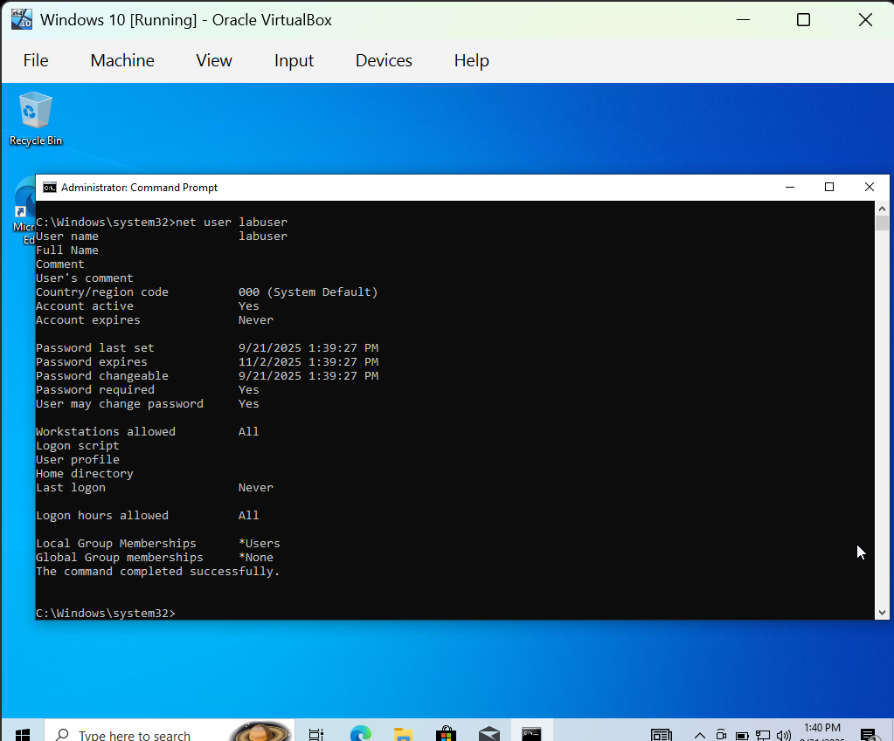
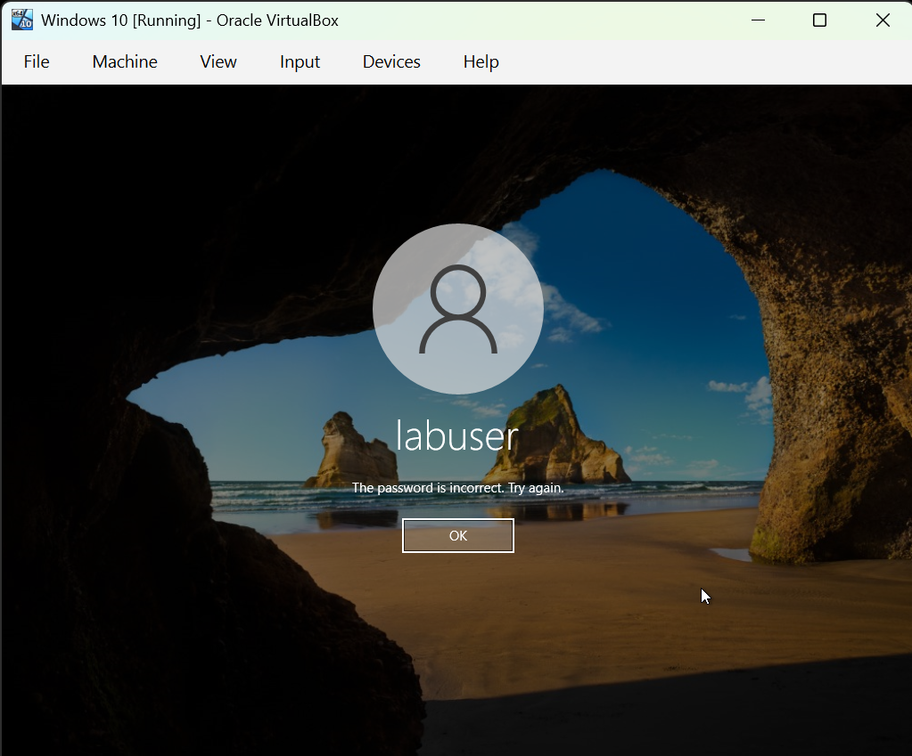
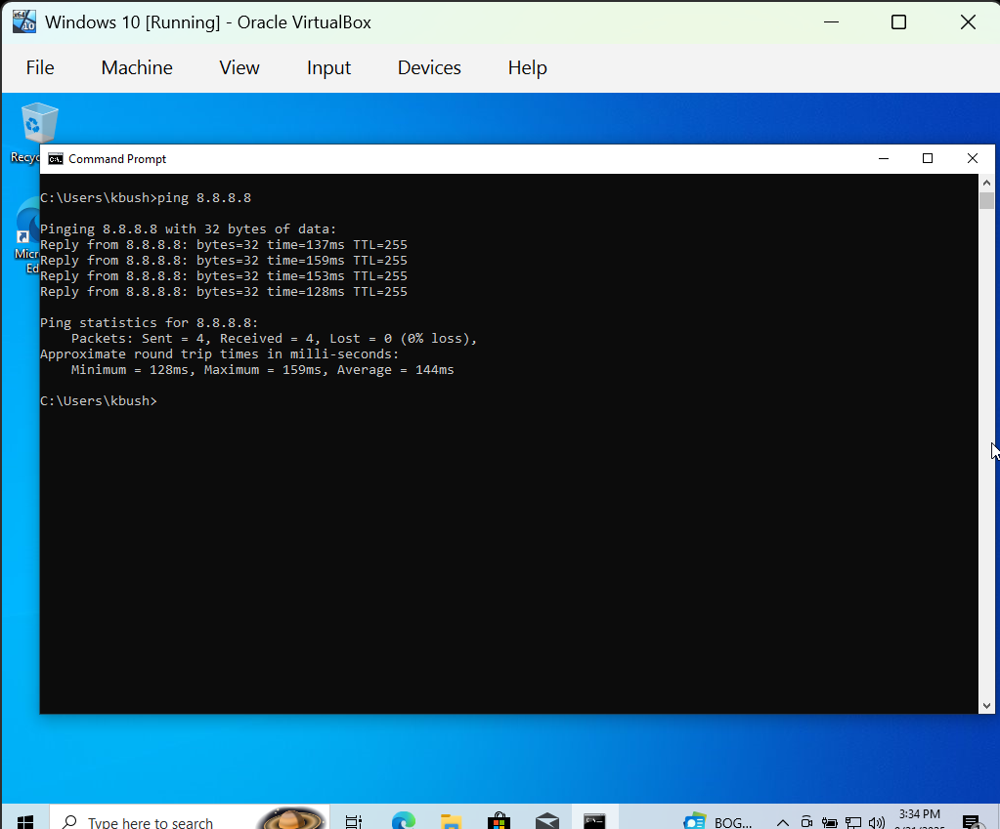
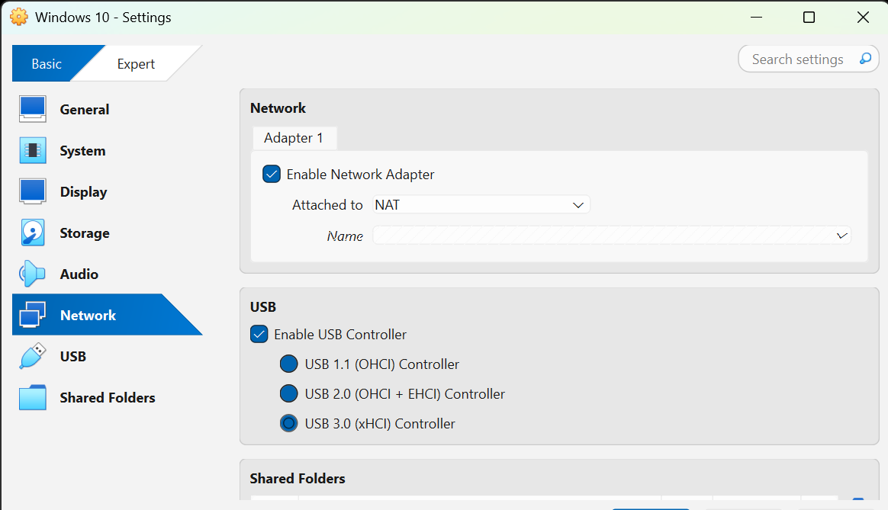
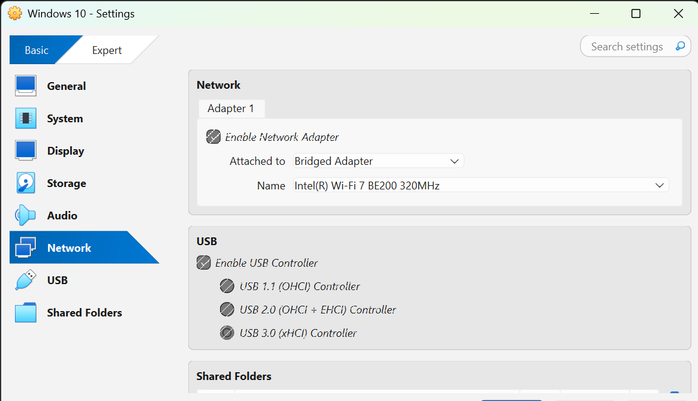

# Lab 1 — Windows User & System Basics

**Goals:**  
- Create and manage local users.  
- Generate and review failed logon events.  
- Install/uninstall software.  
- Verify networking with NAT vs Bridged.  
- Practice device management basics.  

## What I Did
- Created local user `labuser` using `net user`.  
- Generated a failed logon and captured Event ID 4625 in Event Viewer.  
- Installed and uninstalled Notepad++.  
- Verified IP configuration and connectivity with `ipconfig` and `ping`.  
- Compared NAT vs Bridged modes in VirtualBox.  

## Evidence

## Evidence

## Evidence

### Step 1 — Created local user

### Step 2 — Failed logon captured in Event Viewer

### Step 3 — Installed software

### Step 4 — Verified connectivity (ping)

### Step 5 — NAT network mode

### Step 6 — Bridged network mode

## Skills Demonstrated
- Windows account administration  
- Event log analysis (Security/System)  
- Software installation/removal  
- Network troubleshooting (NAT vs Bridged)  
- Device management basics  
