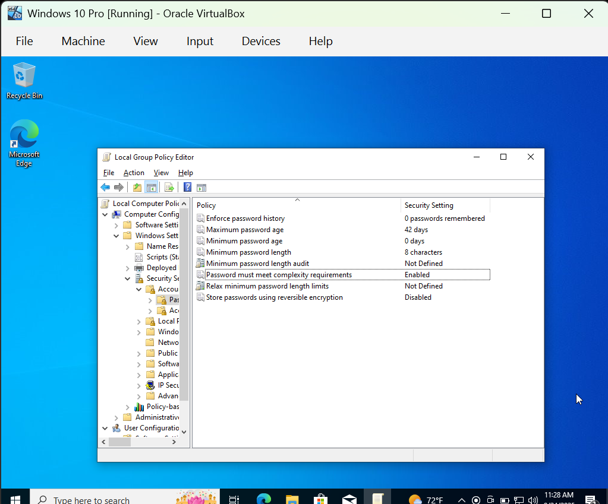

# Windows Lab 2 — User Accounts, Lockout Policy, and Password Policy

## Overview
This lab demonstrates creating and managing users, testing logons, configuring account lockout policies, and enforcing password complexity requirements on Windows 10 Pro.

---

## 🔹 Steps & Screenshots

### Step 1 — System Info
  
*Verified Windows version for lab environment.*

### Step 2 — Configure Password Policy
  
*Applied password policy settings via Local Security Policy.*

### Step 3a — Weak Password Attempt
  
*Weak password rejected per policy.*

### Step 3b — Strong Password Success
  
*Strong password accepted successfully.*

### Step 4 — Create New User
  
*Created new user (TestUser2).*

### Step 5a — Failed Logon Event
  
*Event ID 4625 recorded for failed logon attempt.*

### Step 5b — Successful Logon Event
  
*Event ID 4624 recorded for successful logon.*

### Step 6 — Account Lockout
  
*Account locked after 3 invalid attempts.*

### Step 7a — Password Policy Enforcement (Fail)
  
*Password rejected for not meeting complexity requirements.*

### Step 7b — Password Policy Enforcement (Success)
  
*Password accepted after meeting complexity requirements.*

---

## 🔑 Key Skills Practiced
- Local user and group management  
- Password and account lockout policy configuration  
- Security event log analysis (Event IDs 4624 & 4625)  
- Troubleshooting locked accounts & password resets  

---

## 📌 Next Lab
Lab 3 — Group Policy Objects (GPO) and domain join tests.

